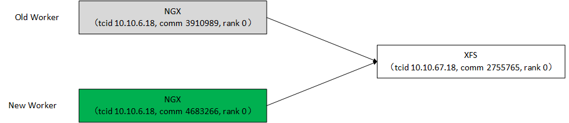
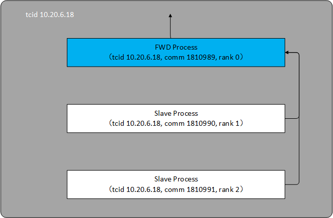

#BGN标识体系

## 1、总览

BGN适用场景为并行和分布式，两个BGN节点之间要考虑如何通信的问题。

通信首先要解决两个问题：（1）如何寻址 （2）协议规范

换言之，在一张互通的网络内，每个通信的节点要唯一标识出来，彼此之间交流的信息格式要定义出来，如同internet的IP地址和TCP/IP协议。

BGN将业务层网络和物理传输网络分离，上层业务组网并不直接依赖于IP地址和端口号，因此BGN需要建立一套独立的标识体系。

先看一条七层心跳日志：

	[2020-04-12 09:58:28.003][tid 3910989][co 0x7fccefa9bab8] isend  req: from (tcid 10.10.6.18,comm 3910989,rank 0,modi 0) to (tcid 10.10.67.18,comm 0,rank 0,modi 0) with priority 2, type 3, tag 1, ldb 8, seqno a0a0612.0.2240, subseqno 0, func id 40000002a

这条日志描述的是源BGN节点向目标BGN节点发送心跳检测的通信要素：

源BGN节点：

	任务通信子：10.10.6.18
	通信子：3910989
	进程组内进程标识：0
	模块实例标识：0

目标BGN节点：

	任务通信子：10.10.67.18
	（任意）通信子：0
	进程组内进程标识：0
	模块实例标识：0
	模块接口标识（十六进制）：40000002a

即，BGN节点的通信主要描述的是两个模块实例之间的通信，简称模块间通信。进一步，源BGN节点无需暴露发起任务请求的模块接口标识，任务请求和任务响应的匹配由任务序号（seqno）和子任务序号（subseqno）完成。

BGN节点通信时的寻址由四元组决定：

	(tcid,comm,rank,modi)

即，任务通信子、通信子、进程、模块实例，下文描述。

BGN节点通信的协议规范，本质是TLV格式定义，简化掉T和L，仅保留V，另文描述。

## 2、通信子（comm）和任务通信子（tcid）

通信子（comm，全称communicator）概念来源于MPI（Message Passing Interface），后者在超算中广泛应用，用来唯一标识一组进程，这组进程在分布式环境下，可以分散在不同的服务器上。

在BGN发展史上，曾经有段时间兼容MPI，所以引入通信子概念，与MPI保持一致；后来与MPI脱钩，通信子名存实亡，只取两个值（91：MPI COMM WORLD和 0： MPI COMM SELF）；再后来，为了适应业务场景的需要，通信子退化为只表达同一台服务器上的一组进程，依然只取91和0两值；直到最近通信子完全与MPI脱钩，取值为这组进程的主进程（转发进程，FWD）的pid，以及表示任意通信子的0值。

所以，在BGN中，通信子（comm）表达的是同一台服务器上的一组进程。在长期具体的实践中，这组进程通常退化为只有一个，即FWD进程，没有遇到多个进程的场景，这是与超算场景不同之处。

任务通信子（tcid，全称task communicator identifier）主要是在业务层网络中唯一标识BGN节点，具有全局唯一性特征。它借助MPI通信子的概念，表达一组进程，因此架空了MPI的通信子，使得后者在一段时间内名存实亡。任务通信子一个重要的用途是完成业务层网络和物理传输网络的映射：

	<tasks tcid="10.10.67.18"  maski="0" maske="0" ipv4="10.63.101.60" bgn="618" rest="718" cluster="1,3"/>

这里ipv4和bgn、rest就是tcid对应的IPv4地址和端口号。

任务通信子采用类似IPv4的点分形式表达，maski/maske分别为业务层网络的内网掩码和外网掩码，即BGN具备七层路由能力，由于实际应用还没有遇到这么复杂的场景，此处不表。

XCACHE将NGX和BGN融合，BGN与XFS（也是BGN节点）保持长连接通信。由于NGX支持reload操作，因此存在新旧两个nginx worker拥有相同的任务通信子（tcid）、不同的通信子（comm）的暂态。

从旧的nginx worker发出的请求，RFS能够正确响应回来，正是基于不同的通信子（comm）来区分的。在nginx reload时，旧nginx worker会立即关闭bgn和rest监听端口，新nginx worker开启bgn和rest监听端口，这是与nginx设计不同的地方：nginx在master进程开启所有监听端口，worker只是继承，而BGN将每个nginx worker赋予唯一的bgn和rest端口号，任务通信子（tcid）和通信子（comm）也不同。

## 3、进程组内进程标识（rank）

任务通信子（tcid）内的一组进程从0开始，唯一编号，名为rank作为进程标识，这个概念也源于MPI。比如有三个进程，依次为rank 0，rank 1，rank 2。

这组进程只能看作一个整体，一损俱损，比如rank 1挂了，则认为整个任务通信子（tcid）都挂了，全体退出。

这组进程中，第一个进程（rank 0）为特殊进程，负责对内、对外转发任务，又称之为转发进程（FWD Process / FWD Rank）。在实际应用中，通常一个任务通信子（tcid）只拥有一个进程，就是转发进程。

## 4、模块标识和模块实例号（modi）

BGN中一切皆是对象，模块就是其中一例。BGN定义模块为：一组数据以及对这组数据进行操作的集合。它强调两点：数据、操作。定义与C++ / JAVA中的类并无实质差异。

BGN对所有暴露在分布式环境中的模块（分布式模块）唯一编号，形如MD_xxx，比如XFS的模块编号为27：

	#define     MD_CXFS      ((UINT32) 27)

在模块的操作集合中，有两个操作是必须要提供的，即模块的启（start）、停（end），比如XFS的启停操作接口：

	UINT32 cxfs_start(const CSTRING *sata_disk_path, const CSTRING *ssd_disk_path)
	void cxfs_end(const UINT32 cxfs_md_id)

模块的启动创建模块的一个实例，返回该实例的编号，这就是实例号（modi），模块的所有其它操作均以该实例号作为第一个参数，相当于将C++ / JAVA类中接口的this指针释放出来了。

对模块实例进行编号，而不是模块实例的指针，这是在分布式环境下寻址的需要，一来指针传输到远端并无实际意义，二来内存的复用性使得指针有错误使用的风险。模块实例号的管理由独立的CBC（Central Board Control，中央控制板）进行。模块实例号在一个进程内唯一，通过模块实例号、模块类型，就可以从CBC查找到模块实例指针。

模块的停止就是销毁指定的模块实例，并将模块实例编号归还给CBC。

为了保持简洁性，BGN表述中经常不区分模块、模块实例、模块对象这些概念，请根据上下文辨别，不要学究。

## 5、模块接口标识（func id/func index）

分布式模块中的所有操作都会唯一编号，由模块类型和操作接口序号组成，全网唯一，形如FI_xxx：

	#define                             FI_cxfs_start  ((UINT32) ((MD_CXFS << (WORDSIZE/2)) +  2))
	#define                               FI_cxfs_end  ((UINT32) ((MD_CXFS << (WORDSIZE/2)) +  3))

模块类型在前半部的高比特位，接口序号在后半部的低比特位。（特别提醒：UINT32表示机器字长，而不是32bits数据类型。在64位系统上，UINT32代表64bits无符号长整型）

细心的读者可能发现了：为什么模块实例号没有携带模块类型信息，而接口标识中携带了呢？

这主要是设计失误。比较牵强的理由是，BGN始于32位系统，如果拿出16比特放模块类型，其支持的模块类型只有65536个，支持的实例数也只有65534个（去掉两个特殊的： ERR MODI， ANY MODI），而BGN期望模块无限可扩展，实例数无上限。时至今日回头看，受限于业务场景、部署方案、硬件限制，这样的理由不成立，16比特足够用。

模块类型信息放进模块实例号中是更合理的设计。今天我们修正这个设计失误，其实除了废点体力，并无任何技术障碍，目前是将错就错的状态。

## 6、内存类型标识

BGN采用条状管理动态内存，每个内存类型都有一个内存管理器，从系统中一次申请多个，连续内存排列，BGN申请时给一个，批发-零售模式。

每个需要动态管理的内存类型都唯一编号（建议全网唯一），形如MM_xxx，在分配与回收内存时使用，比如

	#define                MM_CXFS_WAIT_FILE    ((UINT32)280)
	
	CXFS_WAIT_FILE *cxfs_wait_file;
	
	alloc_static_mem(MM_CXFS_WAIT_FILE, &cxfs_wait_file, LOC_CXFS_0013);
	free_static_mem(MM_CXFS_WAIT_FILE, cxfs_wait_file, LOC_CXFS_0015);

## 7、参数方向与参数类型标识

在两个BGN节点间通信时，需要按照协议规范对数据编码，参数方向和参数类型标识是重要的依据。

接口的参数方向有三种可能：输入（IN）、输出（OUT）、输入输出（IO）。

比如，

	EC_BOOL cxfs_read_e(const UINT32 cxfs_md_id, const CSTRING *file_path, UINT32 *offset, const UINT32 max_len, CBYTES *cbytes);

这里，带const修饰的都是输入参数（cxfs\_md\_id, file\_path, max\_len），不带const修饰的可能是输出参数，也可能是输入输出参数，比如offset是输入输出参数，cbytes是输出参数。

通常，一个输入输出参数可以拆解成一个输入参数 + 一个输出参数，这样用const就可以区分开，否则需要人工界定。保持规范性，有利于工具的使用，比如生成下面的接口定义信息：

	{
	/* -- EC_BOOL cxfs_read_e(const UINT32 cxfs_md_id, const CSTRING *file_path, UINT32 *offset, const UINT32 max_len, CBYTES *cbytes); -- */
	/*func module     */     MD_CXFS,
	/*func logic addr */     (UINT32)cxfs_read_e,
	/*func beg addr   */     0,
	/*func end addr   */     0,
	/*func addr offset*/     0,
	/*func name       */     "cxfs_read_e",
	/*func index      */     FI_cxfs_read_e,
	/*func ret type   */     e_dbg_EC_BOOL,
	/*func para num   */     5,
	/*func para direct*/     {E_DIRECT_IN,E_DIRECT_IN,E_DIRECT_IO,E_DIRECT_IN,E_DIRECT_OUT,},
	/*func para type  */     {e_dbg_UINT32,e_dbg_CSTRING_ptr,e_dbg_UINT32_ptr,e_dbg_UINT32,e_dbg_CBYTES_ptr,},
	/*func para val   */     0, 0, {0},
	},

这是通信协议约定的一部分，模块接口约定，它最终影响到编码、解码、构建调用场景时实参与形参结合的方式，非常重要，不能出现丝毫错误。

在模块接口约定中，出现了形如e\_dbg\_xxx的接口参数类型标识，这也是唯一标识的。每种需要通信的数据类型都拥有一个标识，它与内存类型标识不同：前者用于通信，后者用于内存管理。当然，参数类型标识必然要映射到内存类型标识，因为凡是涉及到通信的内存，必然需要动态内存管理。

## 8、位置标识

在第6节举例中，出现了LOC\_CXFS\_0013和LOC\_CXFS\_0015，形如LOC\_xxx\_xxxx的就是位置标识，用来唯一标识出现在代码中的位置。

	#define LOC_CXFS_0013                       ((UINT32)(    1421))
	#define LOC_CXFS_0014                       ((UINT32)(    1422))
	#define LOC_CXFS_0015                       ((UINT32)(    1423))

位置标识与代码高度相关，它的目的是为了跟踪、排查问题，比如内存泄漏、流程流转等。至于为什么不使用\_\_FUNCTION\_\_，\_\_LINE\_\_之类预编译宏，主要是考虑到记录问题，字符串不好记录、两个值不好记录，所以用位置标识唯一化了。

位置标识唯一化通常由辅助工具完成，可以在编译前执行工具。
