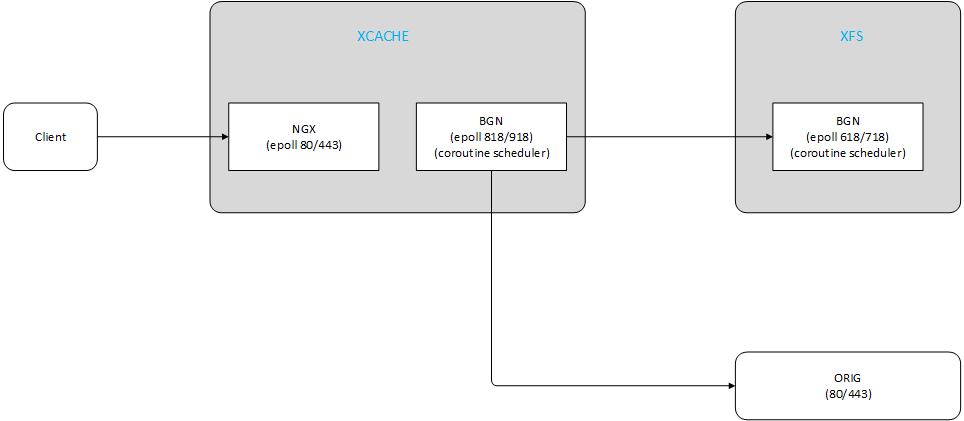
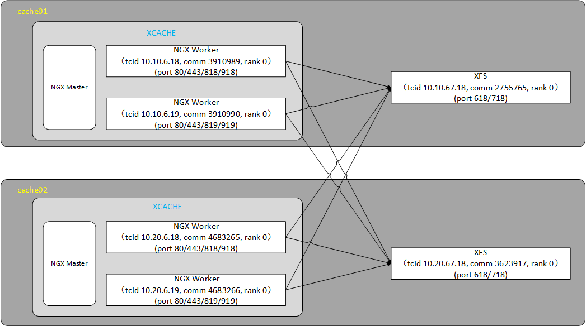

# XCACHE和XFS间通信

## 1、驱动模型与数据流

XCACHE将NGX和BGN融合后，形成双epoll + 协程调度器的驱动模型。XFS是BGN的一个分布式模块，依然由BGN的epoll +协程调度器驱动。

客户端请求由NGX epoll接入，与XFS的交互以及与回源方向的交互，则由BGN epoll负责。

举例描述功能，其中端口号为示意，具体看配置：

XCACHE侧：

	* NGX 80/443端口： 走HTTP/HTTPS协议，负责与客户端的交互

	* BGN 818端口：走BGN协议，负责与XFS和CONSOLE交互，以及其它走BGN协议的端交互

	* BGN 918端口：走HTTP/HTTPS协议，负责NGX REST API交互

XFS侧：

	* BGN 618端口：走BGN协议，负责与XCACHE和CONSOLE交互，以及其它走BGN协议的端交互

	* BGN 718端口：走HTTP/HTTPS协议，负责XFS REST API交互

## 2、网络架构

XCACHE将nginx worker进程改造成唯一可标识的。每个nginx worker拥有唯一的tcid，以及对应的物理传输网络的bgn端口和rest端口。

XFS采用单盘单进程管理。每个XFS进程拥有tcid唯一标识，以及对应的物理传输网络的bgn端口和rest端口。

nginx worker进程和XFS进程之间两两建立长连接。节点内所有nginx worker进程看作一个资源池，所有XFS进程看作一个资源池，两个池之间遵从master-slave的计算（网络）模型。

上图配置说明：

tcid和物理传输网络映射关系配置：

    <tasks tcid="10.10.67.18"  maski="0" maske="0" ipv4="10.63.101.59" bgn="618" rest="718" cluster="1,3"/>
    <tasks tcid="10.20.67.18"  maski="0" maske="0" ipv4="10.63.101.60" bgn="618" rest="718" cluster="1,3"/>
    <tasks tcid="10.10.6.18"  maski="0" maske="0" ipv4="10.63.101.59" bgn="818" rest="918" cluster="1,3,4"/>
    <tasks tcid="10.10.6.19"  maski="0" maske="0" ipv4="10.63.101.59" bgn="819" rest="919" cluster="1,3,4"/>
    <tasks tcid="10.20.6.18"  maski="0" maske="0" ipv4="10.63.101.60" bgn="818" rest="918" cluster="1,3,4"/>
    <tasks tcid="10.20.6.19"  maski="0" maske="0" ipv4="10.63.101.60" bgn="819" rest="919" cluster="1,3,4"/>

master-slave计算（网络）模型配置：

    <cluster id="3" name="xfs-ngx" model="master_slave">
      <node role="master"   tcid="10.10.67.18" rank="0"/>
      <node role="master"   tcid="10.20.67.18" rank="0"/>
      <node role="slave"   tcid="10.10.6.18" rank="0"/>
      <node role="slave"   tcid="10.10.6.19" rank="0"/>
      <node role="slave"   tcid="10.20.6.18" rank="0"/>
      <node role="slave"   tcid="10.20.6.19" rank="0"/>
    </cluster>

## 3、建连过程

按启动先后顺序看：

（1）NGX先启动，XFS后启动：XFS查看配置得知自己角色是master，尝试与所有角色是slave的BGN节点建连。

（2）XFS先启动，NGX后启动：NGX查看配置得知自己角色是slave，尝试与所有角色是master的BGN节点建连。

（3）NGX和XFS都启动后断连：此情况应尽力避免，需要靠第三方探测报告。

## 4、一致性哈希表

每个nginx worker维护一张独立的XFS节点的一致性哈希表。

实节点：每个XFS节点为一个实节点，由XFS的tcid唯一标识。

虚节点：每个实节点虚拟出若干虚节点（缺省配置为32个），虚节点由64bits的哈希值标识。这64bits的构成为：tcid 32bits，replica 16bits（虚节点数）, salt 16bits（当前为实节点在数组中的位置）。哈希算法同ngx\_murmur\_hash2。（注：salt未来应改成缺省做法+可配值，作为出现哈希碰撞时的规避手段）

nginx worker根据每个访问资源在XFS中的存储路径，首先判断是否为热点资源，若不是，则计算CRC32值，据此查找一致性哈希表中对应的活着的XFS节点，发起请求；若是热点资源，则随机挑选一个活着的XFS节点，发起请求。（注：热点资源选择XFS的策略未来会变更）

## 5、读写删

### 5.1、读文件

基于BGN的任务通信机制，nginx worker向特定XFS发起读文件请求：

    MOD_NODE_TCID(&recv_mod_node) = store_srv_tcid;
    MOD_NODE_COMM(&recv_mod_node) = CMPI_ANY_COMM;
    MOD_NODE_RANK(&recv_mod_node) = CMPI_FWD_RANK;
    MOD_NODE_MODI(&recv_mod_node) = 0;/*only one rfs or xfs*/

    task_p2p(CMPI_ANY_MODI, TASK_DEFAULT_LIVE, TASK_PRIO_NORMAL, TASK_NEED_RSP_FLAG, TASK_NEED_ALL_RSP,
        &recv_mod_node,
        &ret, FI_cxfs_read_e, CMPI_ERROR_MODI, file_path, &store_offset, store_size, content_cbytes);

task\_p2p为点对点阻塞任务通信（单播）， recv\_mod\_node为接收端四元组，FI\_cxfs\_read\_e为XFS模块的接口cxfs\_read\_e标识，后面的参数依次为：文件路径（file\_path）、文件内偏移量（store\_offset）、文件读取长度（store\_size）、返回文件内容存放处（content\_cbytes）。

### 5.2、写文件

基于BGN的任务通信机制，nginx worker向特定XFS发起写文件请求：

    MOD_NODE_TCID(&recv_mod_node) = store_srv_tcid;
    MOD_NODE_COMM(&recv_mod_node) = CMPI_ANY_COMM;
    MOD_NODE_RANK(&recv_mod_node) = CMPI_FWD_RANK;
    MOD_NODE_MODI(&recv_mod_node) = 0;/*only one rfs or xfs*/

    task_p2p(CMPI_ANY_MODI, TASK_DEFAULT_LIVE, TASK_PRIO_NORMAL, TASK_NOT_NEED_RSP_FLAG, TASK_NEED_NONE_RSP,
        &recv_mod_node,
        &ret, FI_cxfs_update_with_token, CMPI_ERROR_MODI, file_path, cbytes, auth_token);

task\_p2p为点对点阻塞任务通信（单播）， recv\_mod\_node为接收端四元组，FI\_cxfs\_update\_with\_token为XFS模块的接口cxfs\_update\_with\_token标识，后面的参数依次为：文件路径（file\_path）、文件内容（cbytes）、合并回源过程中获得的token（auth\_token）。

注意：XCACHE中写文件使用的是update接口，而不是write接口（FI\_cxfs\_write），是考虑到出现多个请求独立回源后写盘的情形，所以总是后来的覆盖前面的策略。

### 5.3、删文件/删目录

基于BGN的任务通信机制，nginx worker向节点内全体XFS发起删目前请求：

    cmon_md_id = TASK_BRD_CMON_ID(task_brd);

    cmon_count_nodes(cmon_md_id, &num);

    task_mgr = task_new(NULL_PTR, TASK_PRIO_NORMAL, TASK_NEED_RSP_FLAG, TASK_NEED_ALL_RSP);
    for(pos = 0; pos < num; pos ++)
    {
        CMON_NODE      cmon_node;
        MOD_NODE       recv_mod_node;

        cmon_node_init(&cmon_node);
        if(EC_FALSE == cmon_get_node_by_pos(cmon_md_id, pos, &cmon_node))
        {
            cmon_node_clean(&cmon_node);
            continue;
        }
        if(EC_FALSE == cmon_node_is_up(&cmon_node))
        {
            cmon_node_clean(&cmon_node);
            continue;
        }
        MOD_NODE_TCID(&recv_mod_node) = CMON_NODE_TCID(&cmon_node);
        MOD_NODE_COMM(&recv_mod_node) = CMPI_ANY_COMM;
        MOD_NODE_RANK(&recv_mod_node) = CMPI_FWD_RANK;
        MOD_NODE_MODI(&recv_mod_node) = 0;/*only one rfs or xfs*/

        task_p2p_inc(task_mgr, 0, &recv_mod_node,
                &ret, FI_crfs_delete_dir, CMPI_ERROR_MODI, file_path);
        cmon_node_clean(&cmon_node);
    }
    task_wait(task_mgr, TASK_DEFAULT_LIVE, TASK_NOT_NEED_RESCHEDULE_FLAG, NULL_PTR);

这是BGN的组播任务通信。因为切片的缘故，NGX侧视角看到的任意一个缓存资源，在XFS侧都是以目录形式存在的，因此，XCACHE的文件删除和目录删除，都归结为XFS的目录删除。

考虑到一致性哈希的存在，节点内每个XFS都应该执行一次目录删除动作。示意代码中，首先收集所有活着的XFS信息，然后通过task\_p2p\_inc创建一个子任务（目录删除），再通过task\_wait将整个任务发射出去。至于每个子任务如何到达正确的XFS，则是BGN底层的事，不用管。
